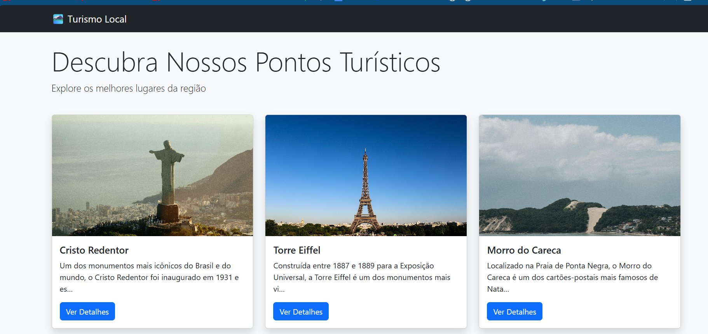
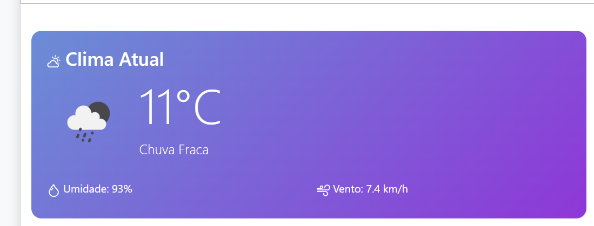
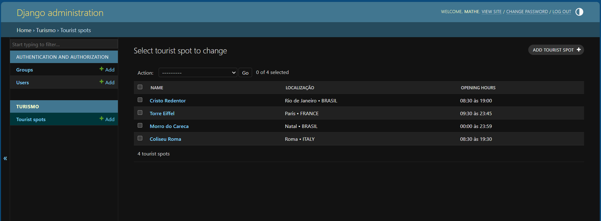
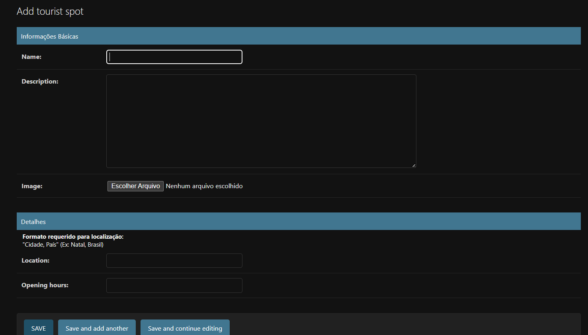

README - Projeto Turismo Local
Visão Geral
O Turismo Local é uma aplicação web desenvolvida em Django que permite aos usuários explorar pontos turísticos de diferentes regiões, visualizar informações detalhadas sobre cada local e conferir condições climáticas em tempo real.

Funcionalidades Principais
 Página Inicial
Listagem dos principais pontos turísticos

Cartões com imagens, nomes e descrições resumidas

Botão "Ver Detalhes" para cada ponto turístico

Página Inicial

  Página de Detalhes do Ponto Turístico
Imagem em destaque do local

Descrição completa

Informações de localização e horário de funcionamento

Clima atual com temperatura, condições, umidade e vento

Acesso direto aos endpoints da API

Página de Detalhes

  Painel Administrativo
Interface para adicionar novos pontos turísticos

Campos para:

Nome do ponto turístico

Descrição detalhada

Upload de imagem

Localização (formato "Cidade, País")

Horário de funcionamento (formato "08:00 às 18:00")

Painel Administrativo

  API Endpoints
Lista de pontos turísticos em formato JSON

Detalhes específicos de cada ponto turístico em JSON

Integração com dados meteorológicos

Tecnologias Utilizadas
Backend: Django

Frontend: HTML, CSS, Bootstrap

Banco de Dados: SQLite

APIs: Integração com serviço de previsão do tempo